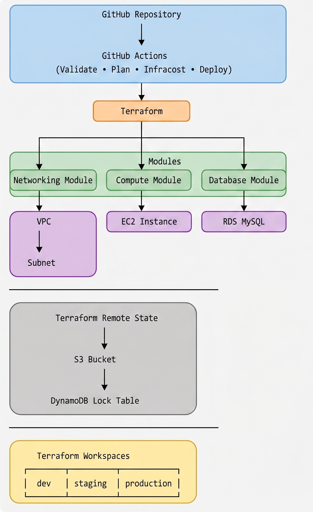
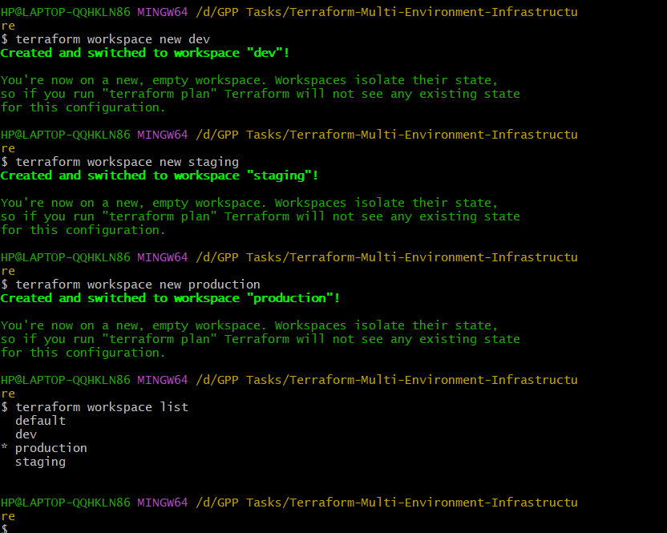
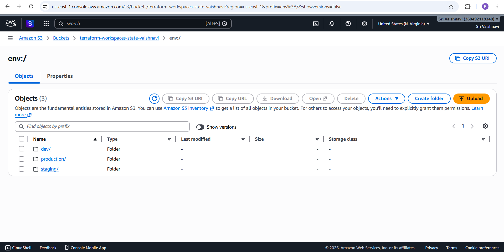
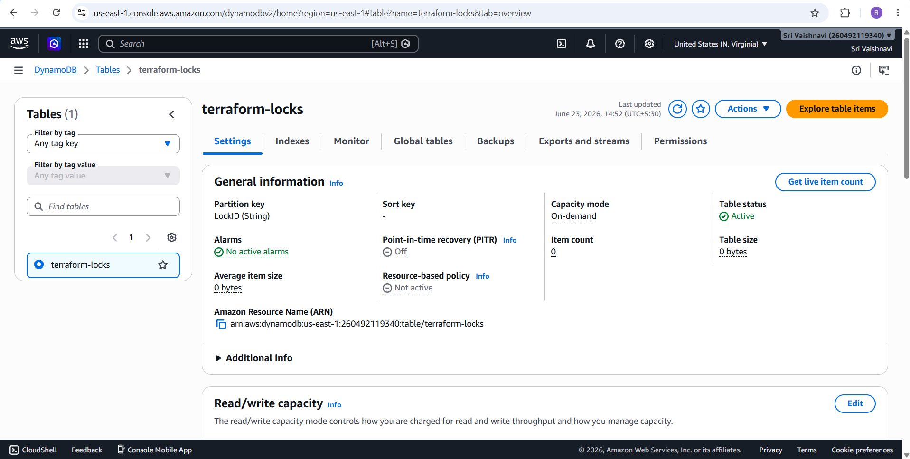
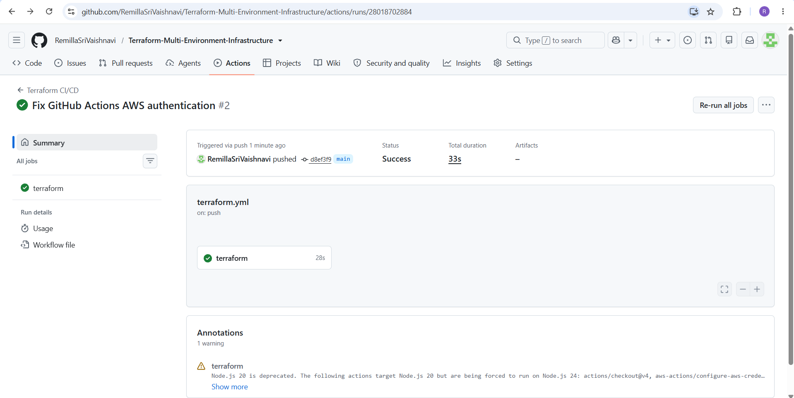
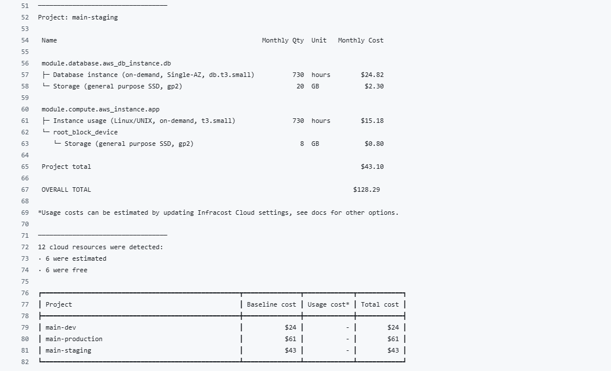
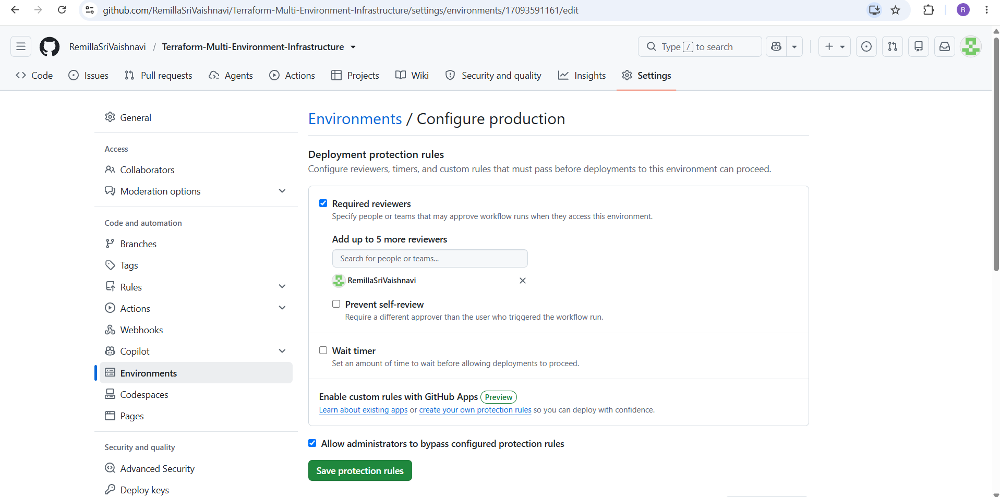

# Terraform Multi-Environment Infrastructure

## Project Overview
This project demonstrates the implementation of a robust multi-environment cloud infrastructure using **Terraform Workspaces**. The infrastructure is designed to manage **Development (dev)**, **Staging (staging)**, and **Production (production)** environments from a single reusable Terraform codebase.

The project follows Infrastructure as Code (IaC) best practices by using modular Terraform configurations, remote state management, state locking, environment-specific configurations, automated CI/CD pipelines, cost estimation, and production deployment approval gates.

## Objectives
* Manage multiple environments using Terraform Workspaces.
* Implement modular and reusable Terraform code.
* Configure remote state management using Amazon S3.
* Enable state locking using DynamoDB.
* Use environment-specific variable files.
* Automate validation and planning using GitHub Actions.
* Integrate Infracost for infrastructure cost estimation.
* Protect production deployments using manual approval gates.


## Architecture Diagram




## Technologies Used
### Infrastructure as Code
* Terraform

### Cloud Provider
* AWS

### Remote State Management
* Amazon S3

### State Locking
* Amazon DynamoDB

### Compute
* Amazon EC2

### Database
* Amazon RDS MySQL

### CI/CD
* GitHub Actions

### Cost Estimation
* Infracost

## Project Structure

```test
Terraform-Multi-Environment-Infrastructure
│
├── .github
│   └── workflows
│       ├── terraform.yml
│       └── production.yml
│
├── environments
│   ├── dev.tfvars
│   ├── staging.tfvars
│   └── production.tfvars
│
├── modules
│   ├── networking
│   │   ├── main.tf
│   │   ├── variables.tf
│   │   └── outputs.tf
│   │
│   ├── compute
│   │   ├── main.tf
│   │   ├── variables.tf
│   │   └── outputs.tf
│   │
│   └── database
│       ├── main.tf
│       ├── variables.tf
│       └── outputs.tf
│
├── screenshots
│
├── backend.tf
├── locals.tf
├── main.tf
├── outputs.tf
├── provider.tf
├── variables.tf
├── versions.tf
├── .gitignore
└── README.md
```

## Terraform Modules
### Networking Module
Responsible for:
* VPC Creation
* Subnet Creation

### Compute Module
Responsible for:
* EC2 Instance Creation

### Database Module
Responsible for:
* RDS MySQL Instance Creation


## Environment Configuration
The project supports three environments:

### Development
```text
Workspace: dev
```
Uses:
```text
environments/dev.tfvars
```

### Staging
```text
Workspace: staging
```
Uses:
```text
environments/staging.tfvars
```

### Production
```text
Workspace: production
```
Uses:
```text
environments/production.tfvars
```

## Remote State Management
Terraform state is stored remotely using Amazon S3.
### Features
* Centralized state storage
* Team collaboration
* State versioning
* Secure storage

Backend configuration:

```terraform
terraform {
  backend "s3" {
    bucket               = "terraform-workspaces-state-vaishnavi"
    key                  = "terraform.tfstate"
    region               = "us-east-1"
    dynamodb_table       = "terraform-locks"
    encrypt              = true
    workspace_key_prefix = "environments"
  }
}
```

## State Locking
Terraform state locking is implemented using Amazon DynamoDB.
Benefits:
* Prevents concurrent modifications
* Avoids state corruption
* Ensures deployment consistency


## AWS Resources Provisioned
### Networking
* VPC
* Subnet

### Compute
* EC2 Instance

### Database
* Amazon RDS MySQL

### State Management
* Amazon S3 Bucket
* Amazon DynamoDB Table


## Terraform Workspace Commands
### Create Workspaces
```bash
terraform workspace new dev
terraform workspace new staging
terraform workspace new production
```

### List Workspaces
```bash
terraform workspace list
```

### Select Workspace
```bash
terraform workspace select dev
terraform workspace select staging
terraform workspace select production
```

## Deployment Steps
### Initialize Terraform
```bash
terraform init
```

### Validate Configuration
```bash
terraform validate
```

### Plan Deployment
#### Development

```bash
terraform workspace select dev
terraform plan \
-var-file=environments/dev.tfvars
```

#### Staging
```bash
terraform workspace select staging
terraform plan \
-var-file=environments/staging.tfvars
```

#### Production

```bash
terraform workspace select production
terraform plan \
-var-file=environments/production.tfvars
```

### Apply Infrastructure
#### Development
```bash
terraform apply \
-var-file=environments/dev.tfvars
```

#### Staging
```bash
terraform apply \
-var-file=environments/staging.tfvars
```

#### Production
```bash
terraform apply \
-var-file=environments/production.tfvars
```

## CI/CD Pipeline
GitHub Actions automates infrastructure validation and planning.
### Pipeline Stages
1. Checkout Repository
2. Configure AWS Credentials
3. Terraform Init
4. Terraform Validate
5. Terraform Plan
6. Infracost Cost Analysis

Workflow file:
```text
.github/workflows/terraform.yml
```

## Production Deployment Workflow
Production deployments are managed separately.
Features:
* Manual Trigger
* Protected Environment
* Required Reviewer Approval

Workflow file:
```text
.github/workflows/production.yml
```

## Infracost Integration
Infracost is integrated into the CI/CD pipeline to estimate infrastructure costs before deployment.
Benefits:
* Cost visibility
* Budget awareness
* Infrastructure optimization


## Screenshots
### Workspace List


### S3 Backend


### DynamoDB Lock Table


### GitHub Actions Success


### Infracost Report


### Production Approval Gate



## Security Considerations
* Remote state stored in Amazon S3
* State locking enabled using DynamoDB
* Production deployments require manual approval
* GitHub Secrets used for AWS credentials
* Infrastructure managed through Terraform


## Expected Outcomes Achieved
* Multi-environment infrastructure deployment
* Remote state management
* State locking implementation
* Workspace isolation
* Automated CI/CD validation
* Infrastructure cost estimation
* Production deployment approval process
* Modular Terraform architecture


### Development
```bash
terraform workspace select dev
terraform destroy \
-var-file=environments/dev.tfvars
```

### Staging
```bash
terraform workspace select staging
terraform destroy \
-var-file=environments/staging.tfvars
```

### Production
```bash
terraform workspace select production
terraform destroy \
-var-file=environments/production.tfvars
```
